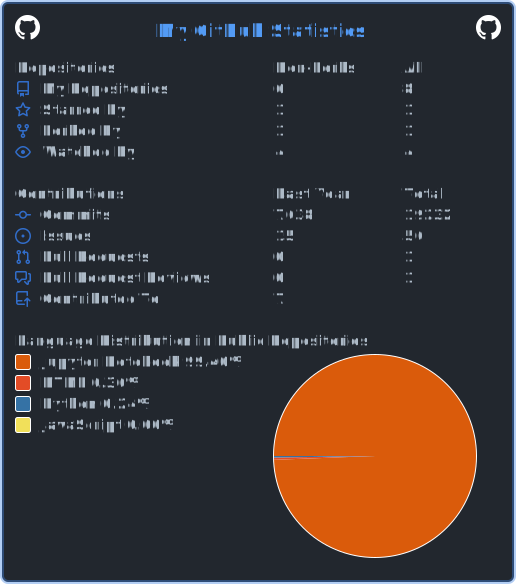

### Hi there 👋
61 48 52 30 63 48 4D 36 4C 79 39 33 64 33 63 75 65 57 39 31 64 48 56 69 5A 53 35 6A 62 32 30 76 64 32 46 30 59 32 67 2F 64 6A 31 59 53 6C 6C 74 65 56 6C 36 64 56 52 68 4F 41 3D 3D

[

<!--
**SSParzival/SSParzival** is a ✨ _special_ ✨ repository because its `README.md` (this file) appears on your GitHub profile.

Here are some ideas to get you started:

- 🔭 I’m currently working on ...
- 🌱 I’m currently learning ...
- 👯 I’m looking to collaborate on ...
- 🤔 I’m looking for help with ...
- 💬 Ask me about ...
- 📫 How to reach me: ...
- 😄 Pronouns: ...
- ⚡ Fun fact: ...
-->
