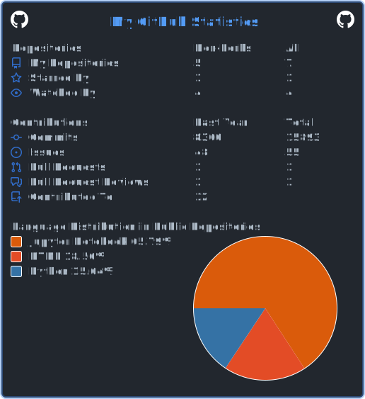

### Hi there 👋

In other words, your fate... no, the fate the two of you share... traps you in an inescapable dead end, a hell of fate, with a 2,578,917 out of 2,578,917 probability. To put it another way, it's a certain fate, with absolutely no chance for a miracle!

What a person's life means, what it's worth, what it is... these are things each person decides for themselves. No matter what sort of fate is forced upon them. Don't accept it. Create your own world... for yourself...!

61 48 52 30 63 48 4D 36 4C 79 39 33 64 33 63 75 65 57 39 31 64 48 56 69 5A 53 35 6A 62 32 30 76 64 32 46 30 59 32 67 2F 64 6A 31 59 53 6C 6C 74 65 56 6C 36 64 56 52 68 4F 41 3D 3D

[

<!--
**SSParzival/SSParzival** is a ✨ _special_ ✨ repository because its `README.md` (this file) appears on your GitHub profile.

Here are some ideas to get you started:

- 🔭 I’m currently working on ...
- 🌱 I’m currently learning ...
- 👯 I’m looking to collaborate on ...
- 🤔 I’m looking for help with ...
- 💬 Ask me about ...
- 📫 How to reach me: ...
- 😄 Pronouns: ...
- ⚡ Fun fact: ...
-->
